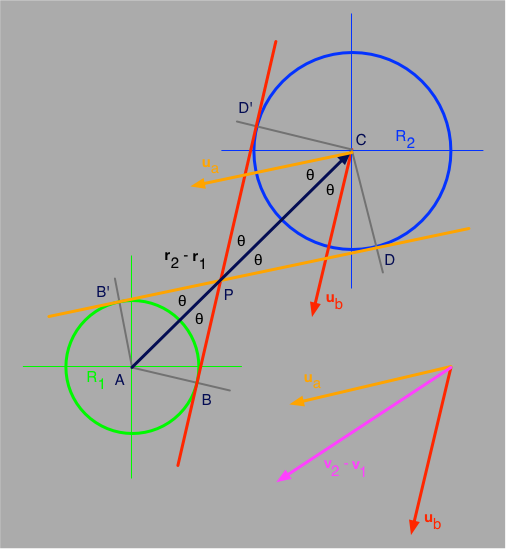

# Sphere Collision Detection

Suppose two spheres (of radii R1 and R2, respectively) are currently located at position vectors **r1** and **r2**, moving with velocity vectors **v1** and **v2**, respectively. Will they collide? If so, when and where?

Originally written on April 23, 2015.

## Creator

That would be me, _Wagner Truppel_. If you need or want to contact me, send a message to `wagner` at `restlessbrain` dot com.

## License

I'm sharing this work under the [Creative Commons Attribution-ShareAlike 4.0 International (CC BY-SA 4.0)](http://creativecommons.org/licenses/by-sa/4.0/) license. See the LICENSE file for more information.
